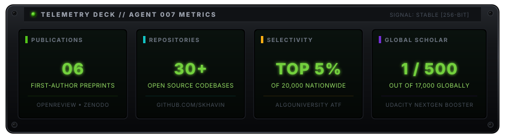

<div align="center">

<!-- ================= PPEditorialNew VECTOR HEADER ================= -->
<a href="https://skhavin.github.io" target="_blank" rel="noopener noreferrer">
  
</a>

<br/>

[](https://skhavin.github.io)
[](https://openreview.net/profile?id=~S_Khavin1)
[](https://zenodo.org/records/22082191)
[](https://linkedin.com/in/s-khavin33)
[](mailto:academic.skhavin@gmail.com)

<br/><br/>

<!-- ================= SKEUOMORPHIC COCKPIT TERMINAL SCREEN ================= -->
<a href="https://skhavin.github.io" target="_blank" rel="noopener noreferrer">
  
</a>

<p align="center">
  <sub>💡 <i>Click anywhere on the terminal screen above to enter the live classified mainframe at <a href="https://skhavin.github.io">skhavin.github.io</a></i></sub>
</p>

</div>

---

### 🛰️ Executive Briefing

Independent researcher working at the intersection of **Mechanistic Interpretability**, **Computational Geometry**, and **Efficient AI Inference**. My work focuses on causal, neuroscience-inspired methods to dissect and accelerate transformer models — isolating sparse subcircuits, mapping representational geometries in residual streams, and designing constant-time memory and retrieval mechanisms.

* 🔬 **Research Core:** Causal Patching, Direct Logit Attribution, Residual Stream Geometry, Dynamic Routing, CKA & DTW
* ⚡ **Systems & Efficiency:** Proactive KV-Cache Eviction ($O(1)$ Attention), Topological Video Event Graphs (Trinetra)
* 🎓 **Academic Foundation:** Pursuing dual degrees in Computer Science from **Sathyabama Institute of Science and Technology** and **Udacity**

---

### 📑 Publications & Preprints

| # | Manuscript Title | Focus & Contribution | Venue & Artifacts |
|---|---|---|---|
| **I** | **[K Heads is All You Need](https://openreview.net/forum?id=eFLz0H38En)**<br><sub>*Task-Dependent Circuit Granularity and Zero-Training Routing in LLMs*</sub> | Proves retrieval in Qwen2.5 is sustained by a 6-head causal circuit. Builds a zero-training geometric router with 100% OOD precision on NVIDIA RULER. | [](https://openreview.net/forum?id=eFLz0H38En) [](https://zenodo.org/records/22082191) |
| **II** | **[The Shape of Computation](https://zenodo.org/records/21738187)**<br><sub>*Language Models Build Universal, Conserved Task Geometries That Are Causally Inert*</sub> | Discovers trunk-and-branch geometry in residual streams across models via CKA-aligned DTW, proving representation maps are epiphenomenal byproducts. | [](https://zenodo.org/records/21738187) [](https://skhavin.github.io/blog/trunk-and-branch-theory-of-computation) |
| **III** | **[Necessary But Not Sufficient](https://openreview.net/forum?id=fW2yC109Zq)**<br><sub>*Convergent Computational Geometry in the Transformer Residual Stream*</sub> | Disproves prompt-invariant head taxonomies; discovers conserved relational task geometries across Qwen, Llama, and Phi architectures. | [](https://openreview.net/forum?id=fW2yC109Zq) [](https://zenodo.org/records/21738188) |
| **IV** | **[HeadGenome](https://zenodo.org/records/21738189)**<br><sub>*A Causal Atlas of 1,568 Attention Heads Across Four Architectures*</sub> | Exhaustive causal knockout mapping of 1,568 heads, uncovering extreme specialization in induction and prefix-tracking modules. | [](https://zenodo.org/records/21738189) |
| **V** | **[O(1) Decode Step Attention](https://zenodo.org/records/21738190)**<br><sub>*Constant-Time Inference via Geometric KV Eviction*</sub> | Geometry-guided proactive KV-cache pruning mechanism that keeps decode step latency strictly $O(1)$ without quality degradation. | [](https://zenodo.org/records/21738190) |
| **VI** | **[Trinetra](https://zenodo.org/records/21738191)**<br><sub>*Temporal Event Graph Architecture for Linear Video Ingest and Constant Query Time*</sub> | $O(N)$ video ingestion with $O(1)$ temporal query engine, replacing dense frame attention with topological event graphs. | [](https://zenodo.org/records/21738191) |

---

### 🎖️ Distinctions, Fellowships & Industry Experience

* 🚀 **SWE Co-Op Intern** — **AlgoUniversity (YC-backed)**: Engineered high-throughput data and AI pipelines with full-stack architecture.
* 🏆 **Team Lead @ Google GenAI Hackathon** — **Top Project Nationwide**: Led team building generative AI solutions for automated workflows.
* 🌟 **AlgoUniversity Technology Fellowship (ATF Accelerator)** — **Top 5% of 20,000 applicants nationwide**: Qualified after technical interview rounds with mentorship from experts at Codeforces, Google, and Microsoft.
* 🎓 **Udacity NextGen Tech Booster Scholar** — **Selected 1 of 500 students out of 17,000 globally** for advanced AI and machine learning scholarship.
* 💼 **Business Analytics Intern** — Market Research Project (HMC), facilitated by Business.io (IIT Madras).
* 🏛️ **National Entrepreneurship Challenge (NEC)** — **IIT Bombay**: 5th place nationwide out of 600+ colleges across India.
* 💻 **Open Source Contributor** — **GirlScript Summer of Code (GSSoC)**: Contributed to open-source developer tooling and ML frameworks.
* 🧠 **Data Science Co-Lead** — **Omdena**: Collaborated on international AI-for-good initiatives and data modeling tasks.

---

### 🛠️ Technical Stack & Methods

```text
[RESEARCH & INTERPRETABILITY]
PyTorch • TransformerLens • Causal Scrubbing • Direct Logit Attribution • CKA & DTW • FAISS

[MODELS & SCALING]
Qwen2.5 • LLaMA-3.2 • Gemma-2 • Phi-3.5 • vLLM • Triton • HuggingFace Transformers

[LANGUAGES & BACKEND]
Python • C / C++ • Java • SQL • TypeScript • JavaScript • Django • FastAPI • PostgreSQL

[FRONTEND & FRAMEWORKS]
Next.js • Astro • React • TailwindCSS • Streamlit • LangChain • LangGraph • Tavily
```

---

### 📊 GitHub Activity & Mission Telemetry

<div align="center">

<!-- Skeuomorphic Mission Telemetry Deck -->
<a href="https://github.com/skhavin" target="_blank" rel="noopener noreferrer">
  
</a>

<br/><br/>

<!-- Verified Working Streak Stats -->
<a href="https://github.com/skhavin" target="_blank" rel="noopener noreferrer">
  
</a>

<br/><br/>

<!-- GitHub Profile Summary Card -->
<a href="https://github.com/skhavin" target="_blank" rel="noopener noreferrer">
  
</a>

</div>

---

<div align="center">

### 🌐 Secure Line & Coordinates

[](https://skhavin.github.io)
[](https://linkedin.com/in/s-khavin33)
[](https://github.com/skhavin)
[](mailto:academic.skhavin@gmail.com)

<sub>File No: `007-AI-NX` • Clearance: `Level 6` • Encryption: `SHA-256` • © S Khavin</sub>

</div>
